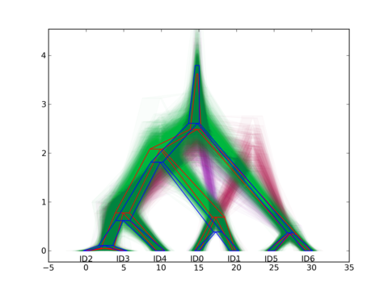

===============
BEAST utilities
===============

-------------------
starbeast_demog_log
-------------------

    A specialized utility for \*BEAST users. The population size numbers as
    reported in the BEAST log can be misleading, since they may refer to
    diffrent populations at diffrent stages of the MCMC chain. This utility
    generates a new trace file, viewable in tracer, tracing population size(s)
    for each population encountered during the run. In addition, a trace is
    created for the species tree topology using a simply heuristic.

------------
summary_tree
------------

    Generate one summary tree from the posterior of a Bayesian
    analysis. BEAST tree annotator selects a topology using the
    "Maximum Clade Credibility" critera and independently assigns a
    height to each internal node. This can result in trees with
    negative branch lengths sometimes.
    
    *summary_tree* offers several methods which do not suffer from
    this problem, and generally outperform tree annotator (though it
    is a difficult task to compare such methods. see *Looking for
    Trees in the Forest: Summary Tree from Posterior Samples*
    (`<http://dx.doi.org/10.6084/m9.figshare.763235>`_ for the
    details).

    *summary_tree* offers several global approaches which search for a
    tree minimizing the mean distance to the whole set of posterior
    trees, using a tree distance score. In addition, there are less
    computetionally demanding methods which perform quite well.

    In addition, *summary_tree* can insure that a generated gene tree is
    compatibile with a given species tree. This can be useful when the
    two are meant to be plotted together.

----------------------------
starbeast_posterior_popsizes
----------------------------

    Annotate a summary \*BEAST species tree (such as the one from
    summary_tree above) with posterior estimates of population sizes.

    On UNIX it is easy to get the tree directly on the command line, e.g

| **$ starbeast_posterior_popsizes $(summary_tree trees.nexus) trees.nexus**

--------------
sptree_plot
--------------

    Generate a figure showing all posterior species trees from a
    \*BEAST analysis. The figure can be used to visually examine the
    uncertainty of both divergence times and population sizes.

    Inspired by `DensiTree
    <www.cs.auckland.ac.nz/~remco/DensiTree/DensiTree.html>`_. Some of the ideas
    developed here became part of DensiTree version 2.

  
-----------------------------------
multispecies_coalescent_estimate
-----------------------------------

    Heuristically estimate the birth rate and effective population
    size from a multispecies data in a \*BEAST XML file.

    See `Average Sequence dissimilarity under simple multi-species coalescent <http://arxiv.org/abs/1104.0727>`_.
