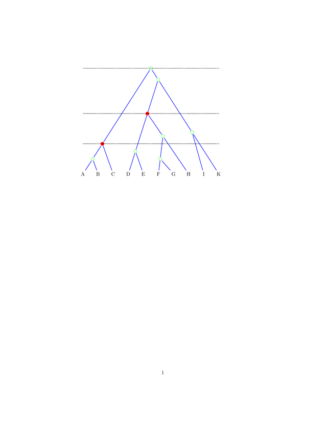

==============
Tree Utilities
==============

------------------
root_unrooted_tree
------------------

    Heuristically root an unrooted (or rooted) tree using either
    midpoint rooting or the root position which minimizes the variance
    of tip ages.

Usage:
^^^^^^

::

  Root using midpoint rooting.
  
| **$ root_unrooted_tree  -m '(a:1,b:2,c:3)'**
| ((a:1,b:2):0.5,c:2.5)

::

  Root using minimim variance.
  
| **$ root_unrooted_tree  '(a:1,b:2,c:3)'**
| ((a:1,b:2):0.75,c:2.25)

---------
tree2tikz
---------

    Generate `tikz code <http://en.wikipedia.org/wiki/PGF/TikZ/>`_ for
    a NEWICK tree. At the moment quite primitive, and the single
    example below shows the full capabilites. However, it may prove
    easier than starting from scratch. There are 4 predefined styles (which may be overwritten):

    ======== =====================
      Name     Value
    ======== =====================
    tip      text centered
    internal green
    line     draw,blue,thick
    hline    densely dotted, thick
    ======== =====================
    
Usage:
^^^^^^

::

  Generate a tree with some (red) marked nodes, and a vertical line passes through them and the root.
  
| $ ``tree2tikz --standalone --style 'marked=thick,red,fill' -o auto '(((A:1,B:1):1,C:2)[&style=marked,vline=hline]:5,(((D:1.5,E:1.5):2.5,((F:1,G:1):1.5,H:2.5):1.5)[&style=marked,vline=hline]:2,(I:2.75,K:2.75):3.5):0.75)[&vline=hline]'``

